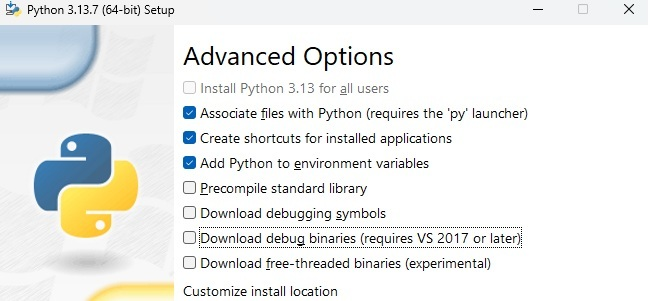
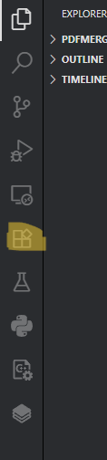
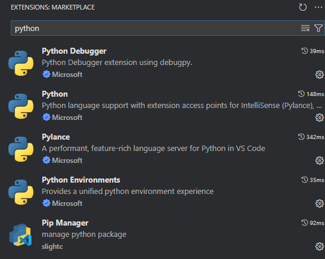

# 💾 Installation de Python

Ce guide explique comment installer Python sur votre ordinateur.

## Étapes

### 1. Installation de Python
- Rendez-vous sur le site officiel de Python :  
  [https://www.python.org/downloads](https://www.python.org/downloads)

### 2. Téléchargez la version adaptée à votre système d’exploitation (Windows, macOS, Linux).

### 3. Lancez le fichier téléchargé et suivez les instructions d’installation.

### 4. **Important** : Cochez l’option `Add Python to PATH` lors de l’installation pour pouvoir utiliser Python depuis le terminal.  
- ⚠️ Option “Precompile standard library” : facultative, améliore légèrement la vitesse de démarrage de Python.

Normalement (sur Windows), vous devriez voir les deux fenêtres suivantes lors de l'installation :

<p align="center">
  
  
</p>

### 5. Vérifiez l’installation
Ouvrez un terminal ou l’invite de commandes et tapez :  

```cpp
python --version      # Si vous êtes sur Mac OS ou Linux
python.exe --version  # Si vous êtes sur Windows
```
### 7. Post installation de VS Code -
VS Code ne supporte pas directement le python, il faudra lui installer quelques extensions pour le bon déroulement de la suite. 
  - Pour ce faire, lancez VS Code.
  - Une fois le programme lancé, vous devriez voir sur la barre latérale gauche cette icône :<p align="center">   </p> Rechercher "Python" dans la barre de recherche et assurez-vous que toutes ces extensions soient bien installées ( normalement vous devriez voir un bouton "install" à coté de chacune des extensions.

 
 
 ### 7. 👏👏👏 Vous êtes enfin prêt pour la suite !
