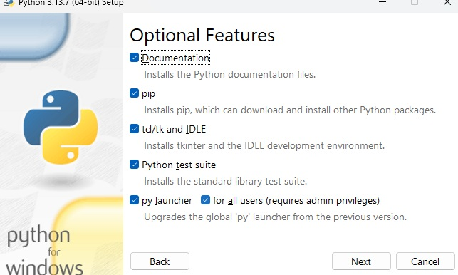

# 💾 Installation de Python

Ce guide explique comment installer Python sur votre ordinateur.

## Étapes

### 1. Installation de Python 
- Rendez-vous sur le site officiel de Python :  
   [https://www.python.org/downloads](https://www.python.org/downloads)

### 2. Téléchargez la version adaptée à votre système d’exploitation (Windows, macOS, Linux).

### 3. Lancez le fichier téléchargé et suivez les instructions d’installation.

### 4. **Important** : Cochez l’option `Add Python to PATH` lors de l’installation pour pouvoir utiliser Python depuis le terminal.<br>

Normalement ( sur windows en tout cas ), vous devriez avoir les 2 fenêtres suivantes lors de l'installation.

<p align="center">
  
  
</p>


### 5. Vérifiez l’installation en ouvrant un terminal ou l’invite de commandes et en tapant :  
   ```bash
   python --version # Si vous êtes sur Mac OS ou Linux

   python.exe --version # Si vous êtes sur Windows
```

### 6. Installation de Visual Code et comment bien le paramétrer.
-   Rendez-vous sur ce lien : [https://code.visualstudio.com](https://code.visualstudio.com)
- Télécharger le et installer le comme n'importe quelle programme classique.

### 7. Post installation de VS Code
- VS Code ne supporte pas directement le python, il faudra lui installer quelques extensions pour le bon déroulement de la suite.
- Pour ce faire, lancez VS Code.
- Une fois le programme lancé, vous devriez voir sur la barre latérale gauche cette icône :<p align="center">
  
  
</p>
